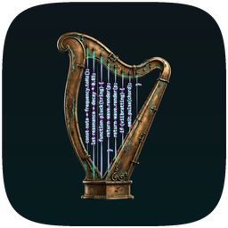

<div align="center">



# Fabled

*A native Apple Silicon Mac client for Claude Code.*

 &nbsp;
 &nbsp;
 &nbsp;


</div>

---

I have been playing more over time with Claude Code, and because I'm not a programmer I use the desktop app more than the terminal. The desktop app though is is Electron and feels it. Hence, Fabled - this is a custom SwiftUI macOS app build to wrap the claude code CLI with sessions, OAuth, etc, etc. As far as I know this doesn't exist so - with the help of Claude code haha - I'm making it.

No grand roadmap here, this is scoped out plan by plan (and orchestrated by Claude Fable, built by Opus), with thinkgs added as they're needed. First goal is a daily-driver replacement for the desktop app: coding sessions, general chat, cowork-style tasks, with an embedded terminal as a backup in case it breaks.

---

## Status

<details>
<summary><strong>Full plan status</strong></summary>

### Plan 1 — ClaudeKit engine ✅
- [x] Swift package speaking the CLI's stream-json protocol end to end
- [x] Process spawning with the verified flag set (`--verbose --input-format stream-json --output-format stream-json --permission-prompt-tool stdio`)
- [x] Event decoding — tolerant of unknown event types (protocol drift shouldn't crash the app)
- [x] Outbound control messages (permission responses, etc.)
- [x] `fabled-probe` — small CLI for recording/verifying live protocol behaviour against a real `claude` binary
- [x] 25 tests, fixture-driven, 2 live-gated

### Plan 2 — SessionStore + history search
- [x] Full TDD plan written (11 tasks, complete code, nothing left to design)
- [x] Transcript fixtures recorded (3 real sessions + synthetic edge cases)
- [ ] Implementation — not started

### Plan 3 — App shell
- [ ] Design brief only, not yet expanded into a working plan

### Plan 4 — Full surfaces
- [ ] Design brief only, not yet expanded into a working plan

</details>

---

## Get it running

There's no shipping build yet — this is source-only, dev-only, for now.

```sh
swift build
swift test                     # offline suite, fixture-driven
CLAUDEKIT_LIVE=1 swift test    # + live tests against a real claude CLI (costs a little money, runs on haiku)
```

Requires macOS 15+, Swift 6, and the `claude` CLI on your `PATH`.

## Structure

- `Sources/ClaudeKit` — the protocol engine: process spawning, event decoding, session config, outbound control messages. Zero third-party deps by design.
- `Sources/fabled-probe` — probes the live CLI so protocol behaviour gets verified, not assumed.
- `Tests/ClaudeKitTests` — offline fixture-driven tests, plus env-gated live tests.
- `fixtures/` — recorded real CLI protocol transcripts, ground truth for the codec.
- `docs/superpowers/` — specs, plans, and the coordination handbook this whole project runs on.

## Why "Fabled"

Named for [Fable](https://claude.com), who coordinates the plans here while Opus subagents do the typing — a credit-conservation trick that turned out to be a decent way to build software either way.

---

<sub><em>Built on the Claude Code CLI. Not an official Anthropic product.</em></sub>
